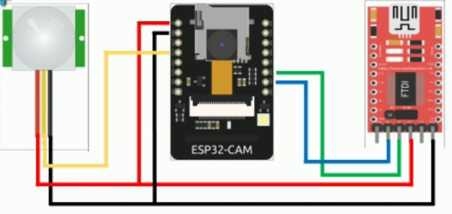

# ESP32 Motion Detection with Firebase Integration

This project demonstrates how to use an ESP32 camera module to implement motion detection using a PIR sensor and integrate it with Firebase for real-time data updates and image storage.



## Features
- Motion detection using a PIR sensor.
- Capturing images with the ESP32 camera upon motion detection.
- Uploading images to Firebase Storage.
- Real-time database commands to:
  - Trigger photo capture.
  - Enable/disable the PIR sensor.

## Hardware Requirements
- ESP32-CAM module.
- PIR motion sensor (connected to GPIO 13 by default).
- Power supply for the ESP32-CAM (e.g., USB or 5V adapter).
- MicroSD card for local storage (optional).

## Software Requirements
- Arduino IDE (or PlatformIO).
- ESP32 board support installed in the Arduino IDE.
- Firebase ESP Client Library for Arduino.
- LittleFS library for file handling.

## Libraries Used
- `Firebase_ESP_Client`
- `WiFi`
- `esp_camera`
- `LittleFS`
- `NTPClient`

Install the required libraries via the Arduino Library Manager.

## Firebase Configuration
1. Set up a Firebase project in the [Firebase Console](https://console.firebase.google.com/).
2. Enable Firebase Realtime Database and Storage.
3. Get your `API Key`, `Database URL`, and `Storage Bucket ID` from your Firebase project settings.
4. Replace the placeholders in the code:
   - `API_KEY`
   - `USER_EMAIL`
   - `USER_PASSWORD`
   - `DATABASE_URL`
   - `STORAGE_BUCKET_ID`


## Usage
### Setup
1. Clone the repository:
   ```bash
   git clone https://github.com/your-username/esp32-motion-detection.git
